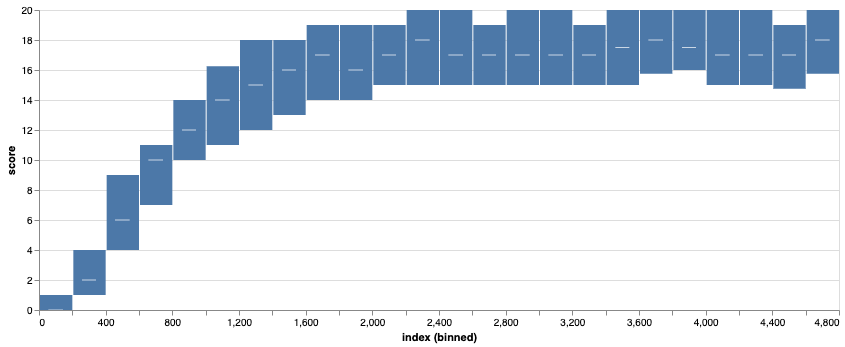

# Assessment Report

This report describes my solution of Udacity Deep Reinformcement Learning nanodegree, Navigation project.

## Learning Algorithm

As a starting point I used the DQN implementation of the Deep Q-Networks lesson. Implementation of the code is at `dqn_agent.py` with a matching model at `model.py`. That baseline implementation was able to reach the +13 point goal around 1100 episodes, but struggled to get any better average than 16. To improve I implemented Double Q-Learning. At the original implementation the target network was updated with a soft update at each learning step. With the extension target network updated less frequently, only at each *TAU_UPDATE_EVERY* step. After some tuning this improved the results, reaching around 17.5 points average within 2000 episodes. To further improve I implemented Dueling Network Architecture for DQN with a change of the model. With that the code was able to reach 18.39 average, the best average I was able to get.

### Model

The final implementation included at `model.py`, receiving `state_size`, `action_size` and `seed`. State and action size set from the environment, here state vector has 37 elements and action size is four. Seed parameter sest the random number generator at torch environment. This makes experiments reproducible.

Input of the network is a `state_size` tensor with a Linear layer `4 * state_size` output features called `fc1` followed by a RelU activation. Next is another Linear layer `fc2` with `4 * action_size` output features followed by a RelU activation.

To implement dueling network architecture there are two Linear layers connected to ReLU activated `fc2`. For the value stream `fc3` is a Linear layer with a single output feature. Advantage stream is at `fc4`, a Linear layer with `action_size` output features. Last module of the model combines the two streams, adding them together but subtracting the mean of the advantage stream. The network outputs `action_size` features.

### Hyperparameters

To tweak the learning process parameters are global variables at `dqn_agent.py`. Replay buffer size, minibatch size and discount factor were not changed during experiments. To train the network I used an nVidia GPU card with 8GB of memory. The system was able to run training sessions and the simulator in none visual mode without any issues.

Learning rate set by the LR variable. After some initial tuning I started to get good results with 5e-4. Later that turned to be a bit aggressive and the network struggled to reach better results than 16 rewards on average. With 1e-4 as learning rate I was able to reach 18.39 at 5066 episodes as the highest average while reaching +13 goal in 953 episodes.

The Double DQN implementation has three parameters. `TAU` to set soft update of target parameters. `UPDATE_EVERY` to set how often to update the network.  `TAU_UPDATE_EVERY` to set how often update target network. For soft updates I'm using `TAU` as 5e-4, i.e. parameters from local network used with weight `TAU` and target parameters as `1 - TAU`. Local network updated at each 4th step, while target network only at each 8th. With these settings I was able to reduce the fluctuation but this is definitely an area to improve.

## Plot of Rewards

With 5e-4 as learning rate I was able to reach +13 average reward in 778 episodes, but that was not able to improve over 17. With the current set of parameters it's reaching in 953 episodes and improves up to 18.39 around 5200 episodes. As the plot at the notebook is too dense to analyze here is a boxplot showing results in bins, using 80 bins to steps up until 5000. All scores saved at `scores.json` as reference. The boxplot show the mean, min and max for each bin. After 1000 episodes avarage rewards are around 13, at 1500 it's reaching 15, from 2000 it's 17. Highest scores reached was reward 29.

## Ideas for Future Work

There are three major areas to improve.

1. Implement Prioritized Experience Replay. That is a well known technique to improve DQN learning. I implemented a preliminary version of it, but it was too slow to sample.

2. Tune hyperparameters. While the current set was able to reach good results, the algorithm and the model are more capable for sure. I stopped tweaking parameters early to concentrate on the algorithmic part.

3. Improve the model. The current model is fairly simple, there are two general ways to improve. First is to play with the size of the features or adding more layers to it. There is a potential here, as the current model is not just simple, but the parameters, like number of neurons are based on hunch and not rigorous tests.

## References

1. [Deep Q-Learning](https://storage.googleapis.com/deepmind-media/dqn/DQNNaturePaper.pdf)

2. [Double Q-Learning](https://arxiv.org/abs/1509.06461)

3. [Prioritized Experience Replay](https://arxiv.org/abs/1511.05952)

4. [Dueling DQN](https://arxiv.org/abs/1511.06581)

5. [Improvements in Deep Q Learning](https://www.freecodecamp.org/news/improvements-in-deep-q-learning-dueling-double-dqn-prioritized-experience-replay-and-fixed-58b130cc5682/)