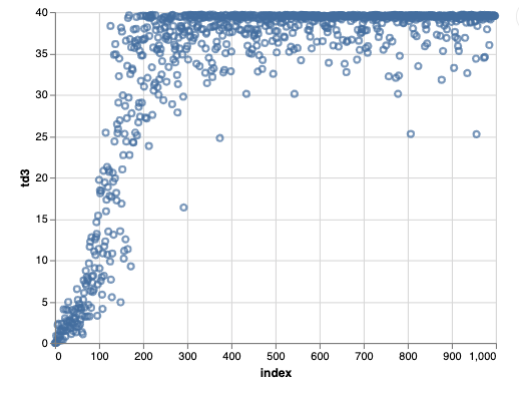
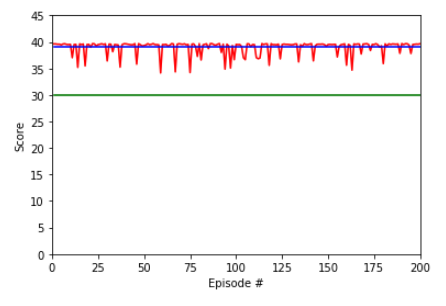
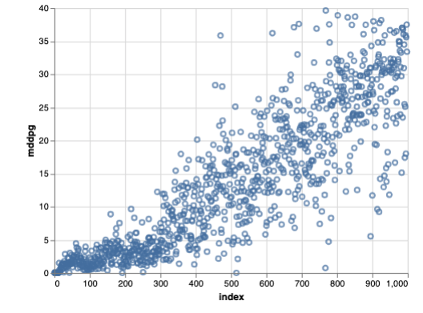
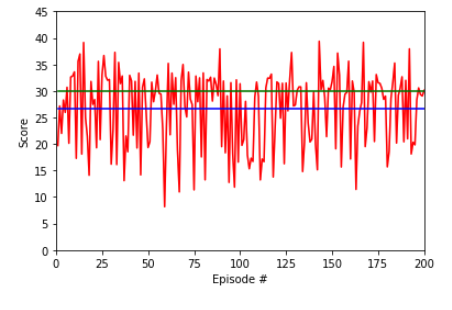

# Assessment Report

This report describes my solution of Udacity Deep Reinforcement Learning nanodegree, Continous Control project.

## Learning Algorithm

At the first two weeks I tried DDPG algorithm to solve the task using the code from the `ddpg-pendulum`. First followed the baseline instructions of the project but failed to reach the goal. Best results were disappointing, maximum was less than 4 and even that faded away during trainings. At one point googled for `ddpg double reacher` and found a few previous solutions of this project. When tried to reproduce them at my own linux machine with CUDA 10 and the latest pytorch they failed the same way, never reached the reported results. Probably something has been changed at pytorch or cuda and DDPG algorithm is sensitive of initial data and training parameters.

Feeling hopeless started to search for approximation errors in DDPG and found a paper right about that: [Addressing Function Approximation Error in Actor-Critic Methods](https://arxiv.org/pdf/1802.09477.pdf). After reading the paper I tried to reproduce they results with the proposed `Twin Delayed Deep Deterministic Policy Gradients (TD3)` algorithm. I added my DDPG implementation at `mDDPG.py` as a reference. For the tests I used my own wrapper around the Unity environment, implemented at `main.py` as `UnityWrapper`.

With they training method, where training step is only after reaching done state from the environment, which is practically each thousand steps, even my DDPG implementation started to behave, the best result over 200 runs was 26.630399. Still not reaching the required 30, but way closer now.

The final implementation included at `TD3.py` with `main.py` to train. For DDPG my implementation is at `mDDPG.py` while the original authors code are at `DDPG.py` and 'OurDDPG.py`. Please note, the original code, even the unused parts at this solution are tweaked and converted to python3.

### Model

The Twin Delayed Deep Deterministic policy gradient algorithm (TD3) is an actor-critic algorithm which considers the interplay between function approximation error in both policy and value updates. I used the original TD3 model without any change. Actor has 3 linear layers, connected with ReLU and a final tanh. Critic has two identical part, both Q1 and Q2 contains 3 linear layers.

For DDPG I added a BatchNorm1d in front of the Critic, otherwise models are the same as the original DDPG implemention. Though it was not able to reach the goal of the project the added normalization layer improved the original implementation by a large margin.

### Hyperparameters

For the TD3 algorithm I haven't changed the default parameters. For DDPG I used the same parameters as discribed at the original paper, including initializations. The only addition is the extra batch normalization layer.

To train I used the single agent version as both TD3 and DDPG are designed for none parallel training. Using the 20 agent version not just slowed down the learning process but actually made it more noisy due to the lot of extra steps with none validated parameters. The trained model is working with the 20 agent environment as well as shown at the project video.

## Plot of Rewards

Training of TD3 reached the goal state around 250 episodes. When trained for a thousand episodes it stabilized and never degreeded. Training data is available at `rewards/TD3_Reacher-v2_2.npy` as a numpy array.

TD3 algorithm even with the default parameters outperformed DDPG with a large margin, here is a graph of a run for 200 runs, generated with `evaluate.ipynb`. It also shows how much more consistent the TD3 algorithm compared to DDPG.

For a pre-recorded video of twenty agens with the provided `pytorch_models/TD3_Reacher-v2_3` model please check my [youtube video](https://youtu.be/mWlLQxQ3Yps). During that recorded video the scores were the followings: 38.51, 39.17, 38.99, 38.49, 38.07

My solution of the project is using TD3 but it's important to compare it with DDPG where I failed to reach the goal. Here is a graph showing training rewards of my tweaked DDPG implementation. Training data is available at `rewards/mDDPG_Reacher-v2_1913792.npy` as a numpy array.

A graph of 200 episodes run of the modified DDPG.

## Ideas for Future Work

Applying the results to similar, but slightly complex problems, like the `Crawl` project could improve the parameters and the training process.

## References

1. [Continuous control with deep reinforcement learning](https://arxiv.org/abs/1509.02971)

2. [Addressing Function Approximation Error in Actor-Critic Methods](https://arxiv.org/pdf/1802.09477.pdf)

3. [TD3 reference implementation](https://github.com/sfujim/TD3)
