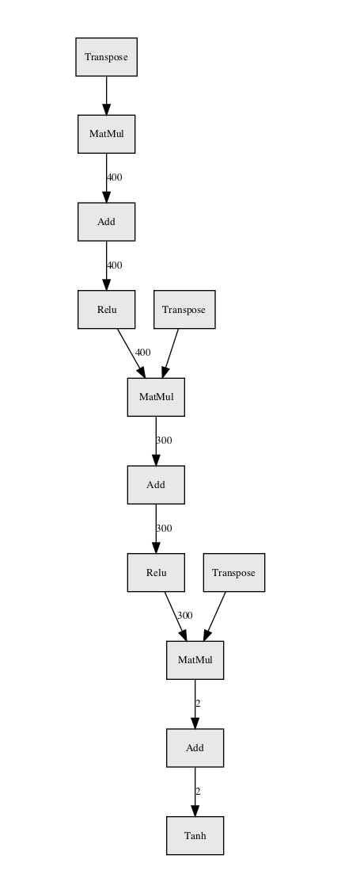
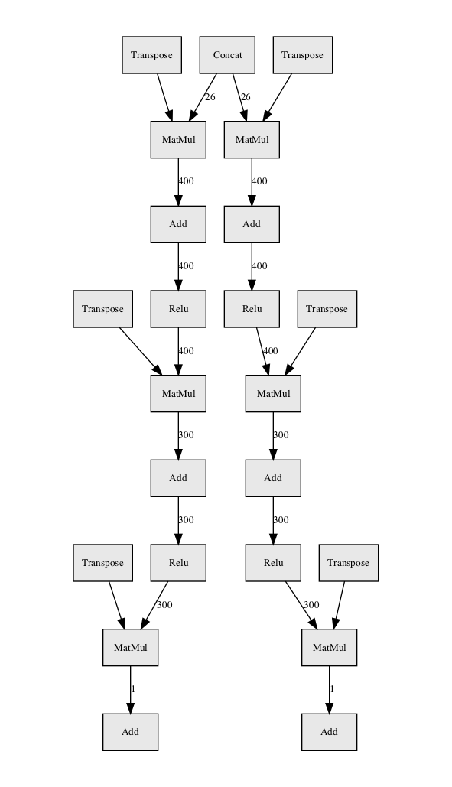
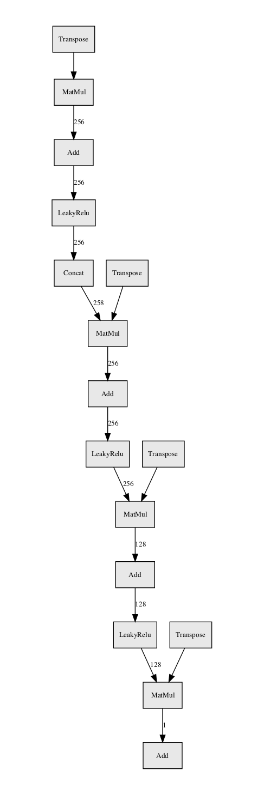
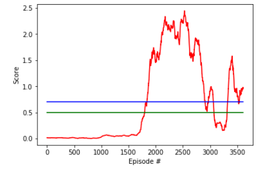
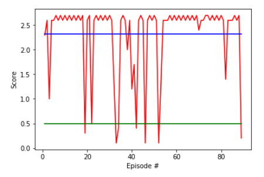
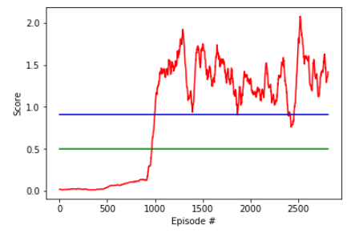
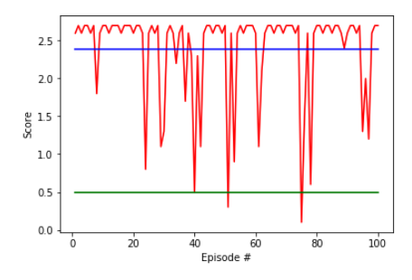
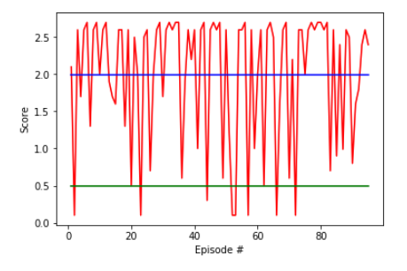

# Assessment Report

This report describes my solution of Udacity Deep Reinforcement Learning nanodegree, Collaboration and Competition project.

## Code organization

- main.py used for training

- td3.py an implementation of `Twin Delayed Deep Deterministic Policy Gradients (TD3)`

- mDDPG.py a modified implementation of `Deep Deterministic Policy Gradients`

- play.py an evaluation run of the saved policies

- utils.py general utility code

- evaluate.ipynb to plot results

## Learning Algorithm

As a starting point I used the previous project where my solution was based on the paper [Addressing Function Approximation Error in Actor-Critic Methods](https://arxiv.org/pdf/1802.09477.pdf) and the accompanying source code of [TD3 reference implementation](https://github.com/sfujim/TD3) of `Twin Delayed Deep Deterministic Policy Gradients (TD3)` and `Deep Deterministic Policy Gradients` algorithms.

DDPG concurrently learns a Q-function and a policy. It uses off-policy data and the Bellman equation to learn the Q-function, and uses the Q-function to learn the policy. It's well suited for this continuous action space of this project, it's very sensitive to hyperparameters and training process. It often overestimates Q-values while learning the Q-function resulting a short period while learning improves but declines fast and never recovers.

TD3 (Twin Delayed DDPG) is a tweaked variant of DDPG. It learns two Q-functions and using the smaller Q-value at each step, clipping the Q-value. Policy and target network updates are delayed, skipping each nth Q-function update steps. TD3 adds noise to target actions which acts as a regularizer, smoothing out actions, preventing sharp steps.

Both algorithms trains a deterministic policy in an off-policy way. To improve exploration during training a random noise is added for each action. As the policy is not known adding randomness is an effective way to explore the action space. While noise is useful during training when evaluating the network only the deterministic policy network used.

I already had a stable implementation of TD3 and DDPG, a Unity wrapper to run the games and a strong framework to train. After five tries I had a solution using TD3 and after two more my tweaked version of DDPG achieved the same level with an average score close to 2 over hundred episodes. All the result, test rewards and final models are saved at this repository.

As the goal of the game is cooperative the best option was to run and to train a single agent, calling it separately for the two players. A single replay buffer holds data for both players. At the first phase of the training each move is random. After enough random data save the next phase of the training starts. The model is not changing for a full episode to keep the environment stable. After the episode is done a training step follows using a fixed number of batch runs with a soft update for each nth cycle.

The training process was the key element at this project. It's based on the reference implementation of TD3, but changed not just parameters like batch size but modified the logic a bit to match with the environment. At Tennis the number of steps at each episode are wildly different, from a dozen to a thousand or anything in between. The original implementation relied on same length episodes with 1000 steps. After identifying it as a source of instability I changed to a fix number of batch runs at each phase of the training, regardless of the given episode length. This improved both the score and the running time as well.

Both TD3 and DDPG achieved good results, it's not uncommon to reach mean scores over a hundred episodes around 2 or above. The best average I found was around 2.4 for 100 episodes. This is close to the upper limit of 2.7 for an episode.

### Model

For both algorithms I'm use simple network models, stick with the reference implementations. As the results are very good in booth cases it was no why to add complexity/

The Twin Delayed Deep Deterministic policy gradient algorithm (TD3) is an actor-critic algorithm which considers the interplay between function approximation error in both policy and value updates. I used the original TD3 model without any change. Actor has 3 linear layers, connected with ReLU and a final tanh. Critic has two identical part, both Q1 and Q2 contains 3 linear layers.

#### TD3 actor model

#### TD3 critic model

For DDPG I added a BatchNorm1d in front of the Critic, otherwise models are the same as the original DDPG implementation.

#### DDPG actor model

#### DDPG critic model

### Hyperparameters

For the TD3 algorithm I haven't changed the default parameters. For DDPG I used the same parameters as described at the original paper, including initializations. Training logs at `logs/td3_out.log` and `logs/ddpg_out.log` contains a dump of the actual command line parameters, they were both trained with default parameters.

Some notable parameters:

  learning rate for actor and critic: 1e-3
  policy update frequency for td3: 2
  policy update frequency for ddpg: 10
  policy noise: 0.2
  target network update rate: 0.005
  discount factor: 0.99
  exploration noise: 0.1
  batch size: 256
  number of training iterations: 10
  training time steps: 1e6
  initial random steps: 1000

The difficult parts was to find the right training parameters. At the initial phase of the training it takes random steps only. After that initial period it runs a complete episode with the current policy but adding random action noise. At the end of each episode it trains with selecting batch size random elements from the replay buffer and repeating that for a number of iterations. The batch size and the number of iterations has a crucial to the training process.

## Plot of Rewards

Training of TD3 reached the goal state around 1800 episodes. It dipped after 2800 episodes but recovered after 3400. Training data is available at `rewards/TD3_Tennis_12.npy` as a numpy array.

TD3 algorithm reached an average of 2.32 over a test run over 100 episodes. Log of the session is at `logs/td3_play.log`.

DDPG training reached goal state after 1000 episodes and kept a scores just below 1 for the rest of the training.

DDPG algorithm reached an average of 2.39 over a test run over 100 episodes. Log of the session is at `logs/ddpg_play.log`.

Mixed results when a TD3 and a DDPG agent played scored 1.99. Log of the session is at `logs/mixed_play_02.log`.

You may find a recorded video of agents playing tennis at [my youtube page](https://www.youtube.com/watch?v=XmKTrw_EpfE)

## Ideas for Future Work

The task goal to play as long as possible resulted an inflexible policy, which was clearly visible when played the two networks together. While DDPG reached higher scores when playing against itself, but was not able to play as well with a TD3 agent, as it learned a rigid game. Training an agent, which is not just able to consistently play with itself for a long but flexible enough to react different agents would be an interesting direction, as well as changing the goal to be competing.

## References

1. [Continuous control with deep reinforcement learning](https://arxiv.org/abs/1509.02971)

2. [Addressing Function Approximation Error in Actor-Critic Methods](https://arxiv.org/pdf/1802.09477.pdf)

3. [TD3 reference implementation](https://github.com/sfujim/TD3)

4. [TD3 algorithm docs](https://spinningup.openai.com/en/latest/algorithms/td3.html)
